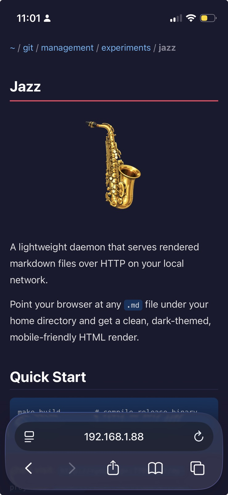

# Jazz

<p align="center">
  
</p>

A lightweight daemon that serves rendered markdown files over HTTP on your local network.

Point your browser at any `.md` file under your home directory and get a clean, dark-themed, mobile-friendly HTML render.

## Install

### Download a prebuilt binary

Grab the latest release for your platform from [GitHub Releases](https://github.com/paradise-runner/jazz/releases):

```bash
# macOS (Apple Silicon)
curl -sL https://github.com/paradise-runner/jazz/releases/latest/download/jazz-macos-aarch64.tar.gz | tar xz
sudo mv jazz /usr/local/bin/

# macOS (Intel)
curl -sL https://github.com/paradise-runner/jazz/releases/latest/download/jazz-macos-x86_64.tar.gz | tar xz
sudo mv jazz /usr/local/bin/

# Linux (x86_64)
curl -sL https://github.com/paradise-runner/jazz/releases/latest/download/jazz-linux-x86_64.tar.gz | tar xz
sudo mv jazz /usr/local/bin/

# Linux (aarch64)
curl -sL https://github.com/paradise-runner/jazz/releases/latest/download/jazz-linux-aarch64.tar.gz | tar xz
sudo mv jazz /usr/local/bin/
```

### Build from source

```bash
make build        # compile release binary
make serve        # start on port 7705
make stop         # kill the server
```

Then visit: `http://<your-ip>:7705/git/my-project/README.md`

## What It Does

<p align="center">
  
</p>

- **Dynamic rendering** — markdown is rendered on each request via pulldown-cmark (CommonMark + extensions)
- **Directory browsing** — navigate folders, only shows directories that actually contain `.md` files
- **Auto-renders README.md** — if a directory has one, it's shown with a file listing below
- **Dark theme** — easy on the eyes, looks good on phones
- **Security** — restricted to `~/`, path traversal blocked, hidden files excluded

## Install as Service

### macOS (launchctl)

```bash
make install-macos    # installs + starts LaunchAgent
make uninstall-macos  # removes it
```

### Linux (systemd)

```bash
make install-linux    # installs + enables user service
make uninstall-linux  # removes it
```

## Configuration

| Flag | Default | Description |
|------|---------|-------------|
| `--port` / `-p` | `7705` | Port to listen on |
| `--bind` / `-b` | `0.0.0.0` | Address to bind to |

Override via Makefile: `make serve PORT=8080`

## Built With

- [Rust](https://www.rust-lang.org/)
- [actix-web](https://actix.rs/) — HTTP server
- [pulldown-cmark](https://github.com/raphlinus/pulldown-cmark) — CommonMark parser
- [clap](https://github.com/clap-rs/clap) — CLI args
